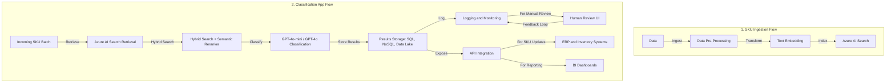

```mermaid
graph TD;
    subgraph "1. SKU Ingestion Flow"
        A[Data] -->|Ingest| B[Data Pre-Processing]
        B -->|Transform| C[Text Embedding]
        C -->|Index| D[Azure AI Search]
    end
        
    subgraph "2. Classification App Flow"
        E[Incoming SKU Batch] -->|Retrieve| F[Azure AI Search Retrieval]
        F -->|Hybrid Search| G[Hybrid Search + Semantic Reranker]
        G -->|Classify| H[GPT-4o-mini / GPT-4o Classification]
        H -->|Store Results| I[Results Storage: SQL, NoSQL, Data Lake]
        
        I -->|Log| J[Logging and Monitoring]
        I -->|Expose| K[API Integration]
        
        J -->|For Manual Review| L[Human Review UI]
        K -->|For SKU Updates| M[ERP and Inventory Systems]
        K -->|For Reporting| N[BI Dashboards]
        L -->|Feedback Loop| J
    end

```